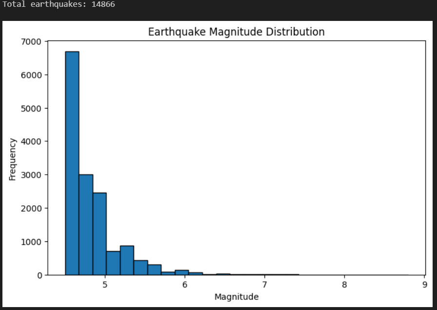
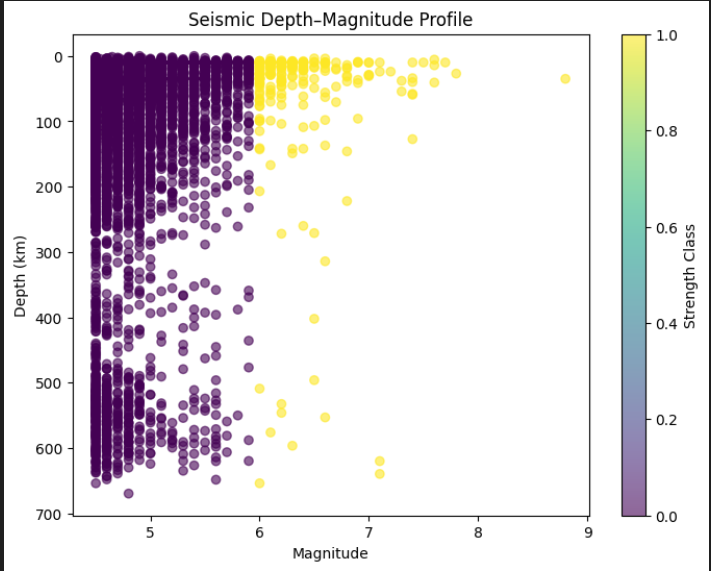
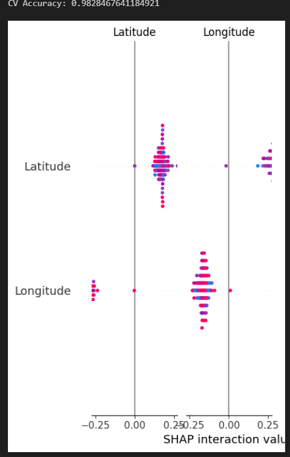
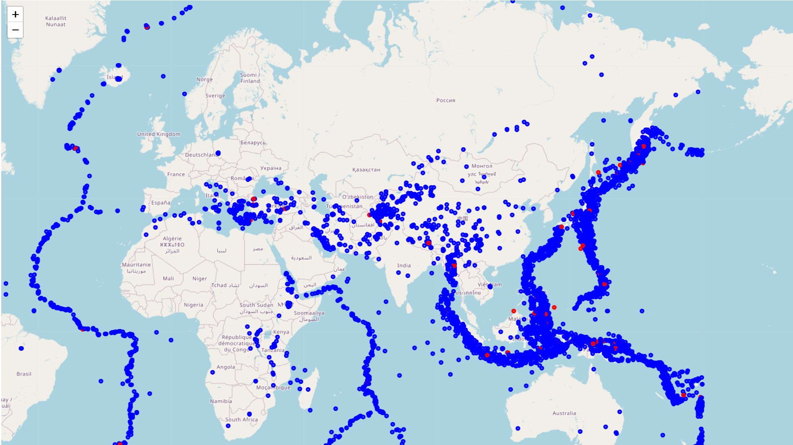

<h1 align="center">
GeoAI Earthquake Strength Classification
</h1>

Machine Learning • Seismology • Geospatial Analysis

---

## 📌 Overview

This project explores how **Machine Learning and Geospatial Analysis** can be used to study earthquake patterns and classify earthquake strength using historical seismic data.

The idea behind this work is to combine **geological understanding with data-driven techniques** to see how earthquake location and focal depth influence seismic energy release.

Rather than building a complex prediction system, this project focuses on **exploratory GeoAI analysis**, making it suitable as an academic mini-project and a starting point for future research in seismology and geospatial data science.

---

## 🎯 Objectives

The main goals of this project are:

- Analyze global earthquake data using machine learning techniques  
- Classify earthquake events into **Weak** and **Strong** categories  
- Study how **depth and spatial location** influence earthquake strength  
- Use **Explainable AI** methods to understand how the model makes decisions  

---

## 🗂 Data Source

Earthquake data used in this project was obtained from the **USGS (United States Geological Survey) Earthquake API**.

Key parameters used:

- Latitude  
- Longitude  
- Focal Depth (km)  
- Magnitude  
- Time of occurrence  

All datasets used in this project are **open-source and publicly available**.

---

## 🧠 Methodology

The workflow of this project follows these steps:

1. Retrieve earthquake data using the **USGS API**
2. Clean and preprocess the dataset
3. Select important features such as **latitude, longitude, and depth**
4. Train a **Random Forest classification model**
5. Handle class imbalance using balanced class weighting
6. Evaluate model robustness using **Stratified K-Fold Cross-Validation**
7. Interpret model predictions using **SHAP (Explainable AI)**
8. Visualize earthquake patterns using statistical plots and geospatial mapping

---

## 🛠 Tools & Technologies

This project was implemented using:

- Python  
- Pandas & NumPy  
- Scikit-Learn  
- SHAP (Explainable AI)  
- Matplotlib  
- Folium (Geospatial Visualization)

---

## 📊 Results & Visualizations

The model successfully classifies earthquake events into **Weak and Strong categories** based on spatial location and focal depth.

Key insights include:

- Strong earthquakes tend to cluster near **tectonically active plate boundaries**
- Depth plays an important role in distinguishing different seismic regimes
- SHAP analysis helps interpret how each feature contributes to the classification

Visual outputs from the project include:

### Earthquake Magnitude Distribution

### Seismic Depth–Magnitude Profile

### SHAP Feature Importance

### Global Earthquake Distribution Map

---

## 🌍 Geological Interpretation

The observed patterns align with the **Gutenberg–Richter magnitude–frequency relationship**, where smaller earthquakes occur more frequently while large earthquakes are relatively rare but release significantly greater energy.

In this model:

- **Latitude and longitude** act as indirect indicators of tectonic environments
- **Focal depth** reflects variations in deformation processes within the Earth's lithosphere

By combining machine learning with geological reasoning, the model captures meaningful seismic trends rather than relying purely on statistical correlations.

---

## 🔮 Future Improvements

This project can be expanded further by:

- Integrating **tectonic plate boundary datasets**
- Adding **spatio-temporal earthquake features**
- Developing more advanced **seismic hazard prediction models**

Such improvements could transform this work into a **more advanced seismic risk modeling framework**.

---

## 👤 Author

**Bikrant Kumar Mishra**  
B.Sc. Geology

---

## 📚 References

1. United States Geological Survey (USGS). Earthquake Catalog API  
   https://earthquake.usgs.gov/fdsnws/event/1/

2. Breiman, L. (2001). Random Forests. Machine Learning Journal.

3. Lundberg, S. M., & Lee, S. I. (2017). A Unified Approach to Interpreting Model Predictions (SHAP).

4. Gutenberg, B., & Richter, C. F. (1956). Earthquake Magnitude, Energy, and Intensity Relationships.

5. USGS Earthquake Hazards Program  
   https://earthquake.usgs.gov/

Research Interests:

GeoAI • Machine Learning • Seismology • Earth System Analysis

---
---

## 🌐 Live Interactive Projects

<a href="https://bikrantmishrageo2005.github.io/GeoAI-Earthquake-Strength-Classification/">

🌍 GeoAI Earthquake Strength Classification

</a>

  

<a href="https://bikrantmishrageo2005.github.io/mineral-prospectivity-mapping/">

⛏ GeoAI Mineral Prospectivity Mapping

</a>

  

<a href="https://bikrantmishrageo2005.github.io/GeoAI-Hydrocarbon-Prospectivity-Modeling/">

🛢 GeoAI Hydrocarbon Prospectivity Modeling

</a>

---
